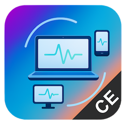

# Deskreen CE (Community Edition)

(Over 2M downloads during 5 years of history)

## Deskreen turns any device with a web browser into a secondary screen for your computer

## To learn more visit our website: [deskreen.com](https://deskreen.com)

## [Donate to support Deskreen Open-Source](https://deskreen.com/#contribute)

Deskreen is an `electron.js` based application that uses `WebRTC` to make a live stream of your computer screen to a web browser on any device. It is available for MacOS, Windows and Linux operating systems.
The current open-source Community Edition version has limited features. If you need more features please consider upgrading to [Pro](https://deskreen.com/download) version for more features when it is released.

---

### ▶️ [See how people use Deskreen on Youtube](https://www.youtube.com/results?search_query=deskreen) (video tutorials, demos, use cases for Deskreen day to day usage)

---

## [Deskreen Frequently Asked Questions](https://deskreen.com/faq)

---

## Deskreen Github Discussion Threads

[Read and Respect our Contributor Covenant Code of Conduct When Writing in our Discussion Threads.](CODE_OF_CONDUCT.m

### [Announcements Channel in Discussions](https://github.com/pavlobu/deskreen/discussions/71)

Some progress and updates on Deskreen can be found [here](https://github.com/pavlobu/deskreen/discussions/71).

---

- [Q&A General](https://github.com/pavlobu/deskreen/discussions/89) - for general questions about Deskreen.

---

- [Bugs General](https://github.com/pavlobu/deskreen/discussions/68) - for general bug reports if you don't know dev environment details. Please include Deskreen version!
  If you saw a bug and know your dev environment, and how to reproduce it, please consider opening a new Issue labeled as Bug and provide full details.

---

- [General Discussion](https://github.com/pavlobu/deskreen/discussions/88) - for general discussion. For example how did you find out about Deskreen? Or send cheers and thanks to anyone in Deskreen's community members. 🎉

---

- [Use Cases for Deskreen](https://github.com/pavlobu/deskreen/discussions/48) - let our community know how you use Deskreen in this thread.

---

- [Enhancements and New Features for Deskreen](https://github.com/pavlobu/deskreen/discussions/50) - share your ideas of what improvements can be done to Deskreen. Issues created with enhancement tag should be related to some concrete example of change in UI, Security patch, Performance improvement with some concrete notes on how you think the problem should be approached. Otherwise for general improvements with short paragraphs post your thoughts [here](https://github.com/pavlobu/deskreen/discussions/50).

---

- [Virtual Display Drivers Knowledge Base | Getting Rid From Virtual Display Plugs](https://github.com/pavlobu/deskreen/discussions/86) - share your knowledge or useful links on how to create a virtual display for any operating system. Links to source code are highly appreciated.

---

- [Cast Audio with Video when screen sharing using WebRTC in Electron | Drivers to pipe audio output as an audio input source that can be read by ElectronJS WebRTC and streamed to client along with video](https://github.com/pavlobu/deskreen/discussions/92) - this feature has been requested multiple times, but it has a long way to go. Share your knowledge or useful links on how to get built in system audio output and put it to WebRTC stream so that client viewing device will be able to play it along with the video stream.

---

 
 

## NOTE: We are looking for a solution to get rid from Dummy Display Plugs while using Deskreen as a second screen. Your code support is highly valuable and welcome in Deskreen!

Display Dummy Plugs are good temporary solution, but it is not that good for everyone.
If you are a seasoned Windows or Linux or MacOS hacker with a knowledge of low level tweaks and tricks, you can help us to make Deskreen better!
On a long run Deskreen seeks for getting rid of Display Dummy Plugs, because most people don't like using them. Sometimes they can't use them because all available display ports are already taken.
**So we need to have native drivers for Win / Mac / Linux that will help to enable virtual display without Dummy Display Plugs.**
There are already working commercial solutions out there with their own drivers which they don't disclose, but this task is doable with a help of entire community.
The goal of Deskreen is to enable community power and knowledge to overcome these technical challenges and make it a go-to second screen solution that everyone will benefit from!

We plan on making virtual display driver support for each of three main operating systems and place all OS related codes in **[`./drivers`](drivers)** subdirectory of this project.
You can find brief requirements for driver API in **[`./drivers/README.md`](drivers)**.

Share your valuable knowledge on how to create virtual desktop **without a Dummy Display Plug [in this discussion thread.](https://github.com/pavlobu/deskreen/discussions/86)**

Thank you in advance!

## Installing with binaries

### Windows

- Get the .msi or .exe file from Releases

### Mac

- Get the .dmg file from Releases

- Or get from [Homebrew](https://brew.sh/): `brew install --cask deskreen`

### Linux

- Debian and Ubuntu based distributions (deb)

- Enterprise Linux based distributions (rpm)

- Arch Linux [AUR Package](https://aur.archlinux.org/packages/deskreen/)

- AppImage for other distributions

## Get Started for Developers

### Prerequisites

You will need to have `node>=v23` `pnpm>=v10.20.0` installed.

1. git clone this repo
2. `pnpm i`
3. `cd ./src/client-viewer && pnpm i && cd ../..`
4. `pnpm clean && pnpm build && pnpm start` -- run in prod like mode

#### for more pnpm commands look at `package.json`

## Maintainer

- [Pavlo (Paul) Buidenkov](https://www.linkedin.com/in/pavlobu)

## License

AGPL-3.0 License © [Pavlo (Paul) Buidenkov](https://github.com/pavlobu/deskreen)

## Copyright

Electron-Vite MIT License © [electron-vite-react](https://github.com/electron-vite/electron-vite-react)

React MIT License © [Facebook, Inc. and its affiliates](https://github.com/facebook/react)

Vite MIT License © [Vite.js](https://github.com/vitejs/vite)

Apache 2.0 © [blueprintjs](https://github.com/palantir/blueprint)

simple-peer MIT. Copyright © [Feross Aboukhadijeh](http://feross.org/)

tweetnacl ISC License © Dmitry Chestnykh, Devi Mandiri, and contributors (https://github.com/dchest/tweetnacl-js)

darkwire.io MIT License © [darkwire/darkwire.io](https://github.com/darkwire/darkwire.io)

And many many others...

## Thanks

🙏 Many thanks to all 🌍 open source community members and maintainers of libraries used in this project.
